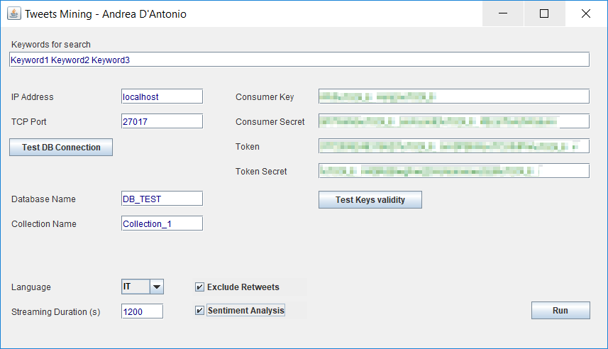

# TweetMining
Applicativo per l'estrazione periodica di informazioni da Twitter su un determinato topic con Sentiment Analysis basata su dizionario

#### Uso

`Lanciare la classe GetTweetGUI del package it.romatre.sii`

